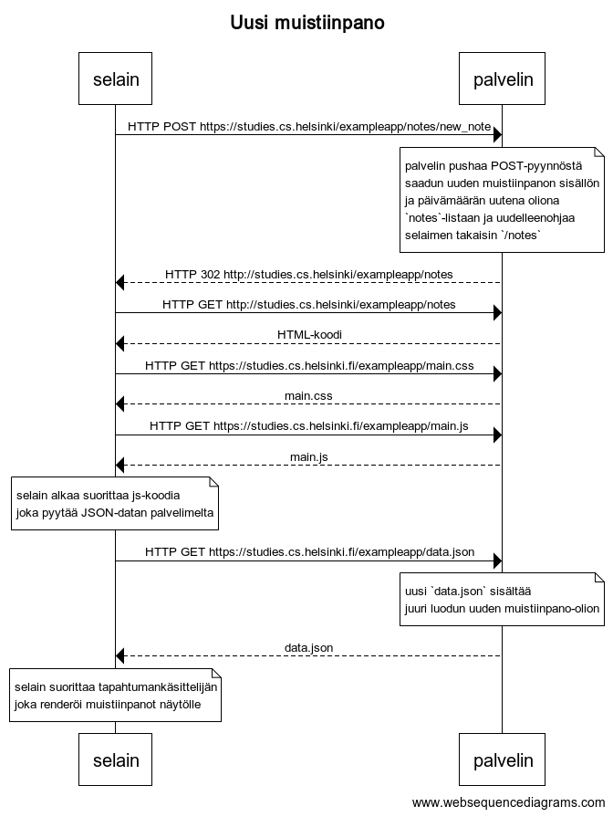

# 0.4: uusi muistiinpano



Kaavion koodi (websequencediagrams.com):

```
title Uusi muistiinpano

selain -> palvelin: HTTP POST https://studies.cs.helsinki/exampleapp/notes/new_note

note over palvelin:
palvelin pushaa POST-pyynnöstä
saadun uuden muistiinpanon sisällön
ja päivämäärän uutena oliona
`notes`-listaan ja uudelleenohjaa
selaimen takaisin `/notes`
end note

palvelin --> selain: HTTP 302 http://studies.cs.helsinki/exampleapp/notes
selain -> palvelin: HTTP GET http://studies.cs.helsinki/exampleapp/notes
palvelin --> selain: HTML-koodi
selain->palvelin: HTTP GET https://studies.cs.helsinki.fi/exampleapp/main.css
palvelin-->selain: main.css
selain->palvelin: HTTP GET https://studies.cs.helsinki.fi/exampleapp/main.js
palvelin-->selain: main.js

note over selain:
selain alkaa suorittaa js-koodia
joka pyytää JSON-datan palvelimelta
end note

selain->palvelin: HTTP GET https://studies.cs.helsinki.fi/exampleapp/data.json

note over palvelin:
uusi `data.json` sisältää
juuri luodun uuden muistiinpano-olion
end note

palvelin-->selain: data.json

note over selain:
selain suorittaa tapahtumankäsittelijän
joka renderöi muistiinpanot näytölle
end note
```
