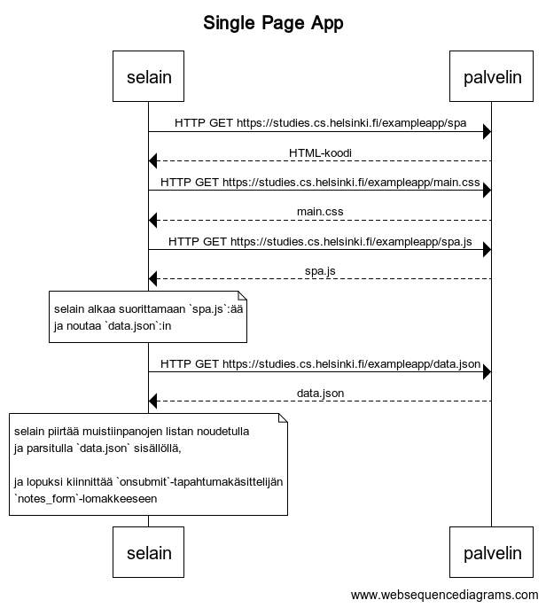

# 0.5: Single Page App



Kaavion koodi (websequencediagrams.com):

```
title Single Page App

selain -> palvelin: HTTP GET https://studies.cs.helsinki.fi/exampleapp/spa
palvelin --> selain: HTML-koodi
selain -> palvelin: HTTP GET https://studies.cs.helsinki.fi/exampleapp/main.css
palvelin --> selain: main.css
selain -> palvelin: HTTP GET https://studies.cs.helsinki.fi/exampleapp/spa.js
palvelin --> selain: spa.js

note over selain:
selain alkaa suorittamaan `spa.js`:ää
ja noutaa `data.json`:in
end note

selain -> palvelin: HTTP GET https://studies.cs.helsinki.fi/exampleapp/data.json
palvelin --> selain: data.json

note over selain:
selain piirtää muistiinpanojen listan noudetulla
ja parsitulla `data.json` sisällöllä,

ja lopuksi kiinnittää `onsubmit`-tapahtumakäsittelijän
`notes_form`-lomakkeeseen
end note
```
