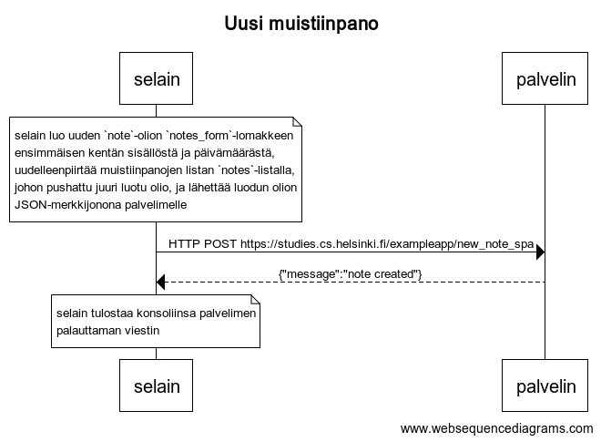

# 0.6: Uusi muistiinpano



Kaavion koodi (websequencediagrams.com):

```
title Uusi muistiinpano

note over selain:
selain luo uuden `note`-olion `notes_form`-lomakkeen
ensimmäisen kentän sisällöstä ja päivämäärästä,
uudelleenpiirtää muistiinpanojen listan `notes`-listalla,
johon pushattu juuri luotu olio, ja lähettää luodun olion
JSON-merkkijonona palvelimelle
end note

selain -> palvelin: HTTP POST https://studies.cs.helsinki.fi/exampleapp/new_note_spa
palvelin --> selain: {"message":"note created"}

note over selain:
selain tulostaa konsoliinsa palvelimen
palauttaman viestin
end note
```
